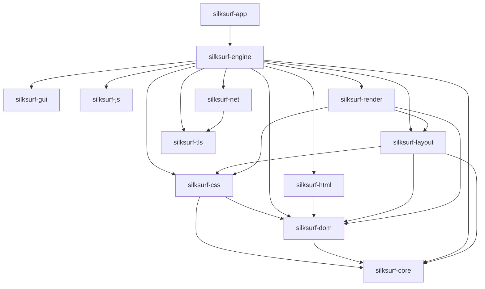

# SilkSurf Architecture

**Status**: Phase 3 (Implementation) in progress
**Next**: Phase 4 (Performance + Integration)
**Toolchain**: nightly-2026-04-05 (rustc 1.96.0-nightly), MSRV 1.94.0

---

## Rust Module Boundaries & Data Flow (Current)
SilkSurf's Rust workspace is split into single-responsibility crates with clear
data ownership boundaries:
- `silksurf-core`: arena allocation + interner + small-string storage.
- `silksurf-html`: HTML tokenizer + tree builder -> `silksurf-dom` nodes.
- `silksurf-dom`: DOM node storage and traversal (IDs + enums, no rendering),
  with mutation batching + dirty-node tracking for incremental style recompute.
- `silksurf-css`: CSS tokenizer/parser + selector matching + computed styles.
- `silksurf-layout`: layout tree/boxes from DOM + computed styles (fixed-point).
- `silksurf-render`: display list + raster output.
- `silksurf-engine`: orchestration pipeline (parse → style → layout → render).
- `silksurf-js`: JS runtime surface and task/microtask queue integration.
- `silksurf-net` / `silksurf-tls`: fetch and TLS plumbing.
- `silksurf-app` / `silksurf-gui`: CLI entry and UI shell.

Data flow (current):
HTML bytes -> tokenizer -> tree builder -> DOM (`NodeId`, `TagName`,
`AttributeName`, `SmallString`, selective id/class interning) -> CSS stylesheet
(`SelectorIdent`, tag/id/class index) -> computed styles via `StyleCache`
-> layout tree (`LayoutBox` + `SilkArena` children) -> display list (optionally
tiled for damage regions) -> raster/GUI. JS tasks (via `JsRuntime`) mutate the DOM
through batched updates and trigger style/layout invalidation; incremental render
flows through `EnginePipeline::render_document_incremental_from_dom`.
Network fetch feeds HTML/CSS/JS inputs.

Fused pipeline (hot path, `FusedWorkspace::run()`):
DOM -> `LayoutNeighborTable::rebuild()` (BFS topology) +
`CascadeView::rebuild()` (40-byte SoA entries + flat SelectorIdent array) ->
single BFS pass: cascade via `CascadeView` (no `dom.node()`) + layout + display
list push. Same-DOM re-renders skip both rebuilds via `Dom::generation()` check.
Lock-free atom resolution via `Dom::resolve_fast()` (monotonic `resolve_table`).
See `docs/PERFORMANCE.md` for measured latencies.

JS runtime integration surface: `crates/silksurf-engine/src/js.rs` defines the
host boundary (`bind_dom`, `evaluate`, `enqueue_task`, `run_microtasks`). The
engine owns scheduling and reflow triggers; see `docs/JS_ENGINE.md`.

## Integration Plan (Open)
- Wire `silksurf-js` into `silksurf-engine` under the `js` feature.
- Define minimal host bindings (DOM query/mutation, task queue).
- Wire `silksurf-net`/`silksurf-tls` behind feature flags and document fetch flow.

## Crate Dependency Graph (Rust)

See `docs/JS_ENGINE.md` for the JS runtime embedding surface and perf plan.
See `docs/DEPENDENCIES.md` for crate roles and dependency rationale.
See `docs/PERFORMANCE.md` for hot paths and perf roadmap.
See `docs/NETWORK_TLS.md` for the fetch/TLS layer configuration.
See `docs/TOOLCHAIN.md` for build and tooling guidance.
See `docs/LOGGING.md` for logging and error reporting expectations.
See `docs/SECURITY.md` for TLS and secret-handling guidance.
See `docs/TESTING.md` for test strategy and fuzzing.

Legacy C sections below are historical reference while migrating to Rust.

---

## Legacy C Architecture
See `docs/archive/legacy/ARCHITECTURE_C.md` for the historical C baseline.
