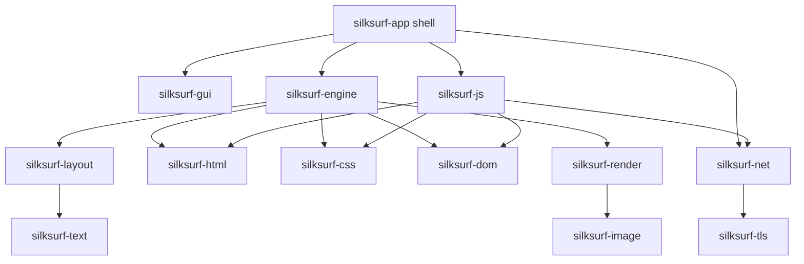

# SilkSurf Architecture

**Status:** integrated single-process browser prototype  
**Next architectural gate:** process-neutral engine protocol and backend spikes  
**Toolchain:** stable Rust 1.94.1, pinned exactly

The active Rust tree already integrates networking, HTML, CSS, JavaScript,
layout, rendering, native input, and window presentation. The principal
architectural limitation is no longer subsystem wiring; it is that page-owned
state and browser-shell state still share one process and one single-view state
machine.

See `docs/STATUS.md` for the canonical evidence summary and
`docs/roadmaps/BROWSER-FUNCTIONALIZATION-ACTION-PLAN.md` for the ordered program.

## Crate ownership

- `silksurf-core`: arenas, interning, compact shared types, canonical errors.
- `silksurf-html`: html5ever tree construction and fragment parsing.
- `silksurf-dom`: DOM storage, traversal, mutation batching, generations, dirty
  nodes, and accessibility snapshots.
- `silksurf-css`: tokenization, parsing, selectors, cascade, computed style,
  media evaluation, and style indices/views.
- `silksurf-layout`: Taffy integration, inline/text layout, bidi and line-break
  support.
- `silksurf-text`: measurement, shaping, font fallback, and glyph rasterization.
- `silksurf-render`: display lists, spatial buckets, damage rasterization,
  tiny-skia fallback, and direct pixel paths.
- `silksurf-engine`: document parsing/render orchestration, fused
  style-layout-paint, and speculative/cache integration.
- `silksurf-net`: HTTP clients, redirects, content decoding, cookies, cache,
  WebSocket and EventSource transport.
- `silksurf-tls`: rustls configuration and diagnostic loading surfaces.
- `silksurf-image`: image decoding.
- `silksurf-gui`: winit event delivery and Wayland/X11 presenters, with optional
  legacy XCB support.
- `silksurf-app`: browser chrome, navigation workers, page assembly, input
  routing, runtime pumping, retained frame composition, and presentation.
- `silksurf-js`: `SilkContext`, Boa integration, DOM/events, timers, fetch,
  sockets, storage, crypto, history intents, and test262 tooling.

## Current load and render path

```text
BrowserNavigationRequest
  -> navigation worker
  -> silksurf-net / silksurf-tls / response cache
  -> HTML bytes
  -> html5ever TreeSink -> silksurf-dom
  -> inline/external CSS and script/module collection
  -> SilkContext over the live shared DOM
  -> script evaluation + jobs + host callback drains
  -> retained FusedWorkspace / StyleIndex
  -> style + Taffy layout + display-list paint
  -> viewport raster or bounded damage update
  -> retained Wayland SHM / softbuffer presentation
```

Native input follows the reverse integration path:

```text
winit input
  -> chrome/page hit test and focus state
  -> DOM event synthesis through SilkContext
  -> JavaScript handler / microtasks / host callbacks
  -> dirty-node extraction
  -> retained text update or fused relayout
  -> damage frame submission
```

## Current process topology

The browser shell and page engine are presently one process:

```text
silksurf-app process
  BrowserState
    browser chrome and navigation state
    optional BrowserPageRuntime
      Arc<Mutex<Dom>>
      SilkContext / boa_engine
      Stylesheet + StyleIndex
      FusedResult + FusedWorkspace
      DisplayList + images + raster scratch
  winit event loop and native presenter
```

This topology is efficient for controlled fixtures, but it is not a security or
reliability boundary. A page hang, resource-exhaustion bug, or unsafe/FFI defect
can affect the shell. It also couples the current shell directly to native-engine
implementation types, blocking interchangeable compatibility backends.

## Event and wake model

The active GUI path is event-driven. Winit uses `ControlFlow::Wait`; navigation,
host callbacks, and other off-loop work wake the event loop through a
`WinitWakeHandle`/event-loop proxy. The previously documented 10 ms in-flight
poll is not part of the current GUI path and is not an open architecture item.

## Current integration status

| Surface | Status |
|---|---|
| HTML/CSS/layout/render pipeline | integrated |
| `silksurf-js`/`SilkContext` in the application | integrated |
| network/TLS/cache in navigation and resources | integrated |
| native pointer/keyboard -> JavaScript events | integrated for current supported controls/events |
| JavaScript mutation -> retained/fused repaint | integrated and probe-backed |
| same-document history intents and persistent local storage | partial |
| complete loader/lifecycle/task-source semantics | open |
| multi-tab/multi-window shell | open |
| renderer process boundary and sandbox | open |
| compatibility-engine backend protocol | open |

The abstraction in `crates/silksurf-engine/src/js.rs` is not the complete
production application path. `silksurf-app` currently instantiates
`silksurf_js::SilkContext` directly and owns runtime scheduling and repaint
integration.

## Target shell/engine boundary

The next boundary is view-oriented and process-neutral. It must not expose DOM,
CSS, JavaScript, or layout implementation types.

Commands include:

- create/close view,
- navigate/reload/stop,
- resize and visibility,
- pointer/keyboard/IME input,
- permission decisions,
- lifecycle and shutdown.

Events include:

- frame handle plus damage and generation,
- title/URL/load-state changes,
- permission/download/new-view requests,
- console/diagnostic metrics,
- crash/hang notification.

Frame transport should prefer platform-native handles where available and
sealed shared memory as the fallback. Ownership requires explicit generations,
release acknowledgement, and stale-engine protection.

## Decision gates before a backend verdict

The program evaluates, rather than assumes, the final compatibility stack:

1. move the existing native runtime behind the protocol and measure process/
   frame overhead,
2. run a WPE WebKit Linux/Wayland embedding spike,
3. run comparable Wry, Servo, and CEF feasibility/footprint probes,
4. record a backend ADR assigning primary, fallback, experimental, or rejected
   roles.

Crate decomposition follows measured ownership after these spikes; the project
must not pre-commit to an arbitrary crate count.

## Conceptual dependency flow



This is the load-bearing architectural flow, not a complete Cargo-edge dump.

## Related documents

- `docs/STATUS.md`
- `docs/JS_ENGINE.md`
- `docs/PERFORMANCE.md`
- `docs/NETWORK_TLS.md`
- `docs/design/THREAT-MODEL.md`
- `docs/design/ARCHITECTURE-DECISIONS.md`
- `docs/roadmaps/BROWSER-FUNCTIONALIZATION-ACTION-PLAN.md`
- `docs/TESTING.md`

Historical C architecture is archived in `docs/archive/legacy/ARCHITECTURE_C.md`.
