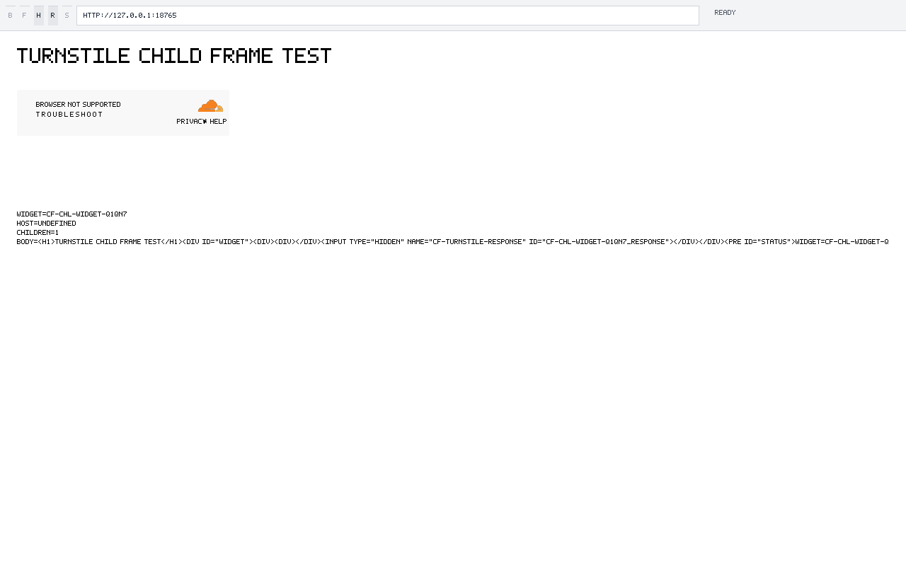
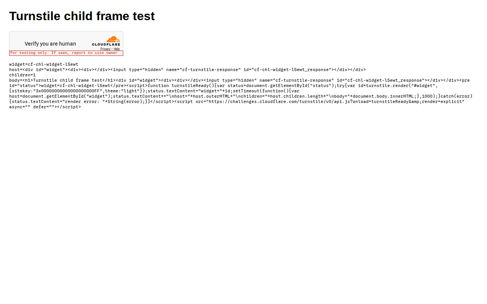

# Cloudflare Turnstile Redirect and Frame Gate

**Date**: 2026-09-23
**Mechanism**: same-host HTTP/2 redirects continue through the bounded HTTP/1.1 redirect loop; iframe documents run in independent runtimes and composite into owner boxes. The Turnstile API creates a closed-shadow iframe and exchanges lifecycle and `postMessage` events before Cloudflare rejects SilkSurf as an unsupported browser.
**Question**: can SilkSurf load Cloudflare's interactive Turnstile test widget and expose a real click target through its embedded-content path?

## Verdict

The redirect defect is repaired by continuing an HTTP/2 redirect response through the existing bounded HTTP/1.1 loop. The continuation starts at the response `Location`, so the initial GET is not replayed. The HTTP/2 path now sends and stores subresource cookies and routes origin-restricted batches through the HTTP/1.1 origin check.

The official Cloudflare test key `3x00000000000000000000FF` loads the 86,732-byte Turnstile API and creates a challenge iframe inside a closed shadow root. SilkSurf fetches and executes the child document, dispatches document lifecycle events, and completes the `init`, `requestExtraParams`, `extraParams`, and `execute` message exchange. The challenge then sends `reject` with reason `unsupported_browser`. The native screenshot displays Cloudflare's browser-not-supported panel without a checkbox.

Chromium 153.0.8010.36 on the same local fixture and test key renders Cloudflare's visible `Verify you are human` checkbox. This control confirms that the key, fixture origin, and network path produce an interactive widget in a supported browser. SilkSurf's live `unsupported_browser` response remains tied to its runtime or browser identity; the challenge does not expose the exact rejection predicate.

The Turnstile API reads `window.innerWidth` and `window.innerHeight` when it builds challenge parameters. SilkSurf now updates both CSSOM View properties from each document's viewport, and a runtime test covers initial dimensions and resize. A fresh native run still receives `unsupported_browser`; the corrected dimensions leave the browser-support gate unresolved.

## Evidence and reproduction

Cloudflare documents the test key as forcing an interactive visible widget in [Test your Turnstile implementation](https://developers.cloudflare.com/turnstile/troubleshooting/testing/). The native X11 run loads that key through `https://challenges.cloudflare.com/turnstile/v0/api.js`, fetches the iframe document, and records the child-to-parent handshake through `execute`. Cloudflare then returns `reject` with `reason=unsupported_browser`; the screenshot captures the rendered rejection panel and the absent checkbox.

Focused tests cover document lifecycle ordering, live `NamedNodeMap` attributes, `NodeIterator` traversal, and the live `document.scripts` collection. `RUSTFLAGS='-D warnings' CARGO_BUILD_JOBS=2 cargo check -p silksurf-app --all-targets` passes. Child-frame navigation and message delivery are runtime evidence; checkbox rendering remains unaccepted.

## Residual

`unsupported_browser` is the remaining live falsifier. The trace establishes child document creation, lifecycle dispatch, parent/child messaging, and the rejection reason. The exact browser capability or identity predicate remains opaque. The visible checkbox and its click target remain unavailable until the challenge accepts the runtime.
