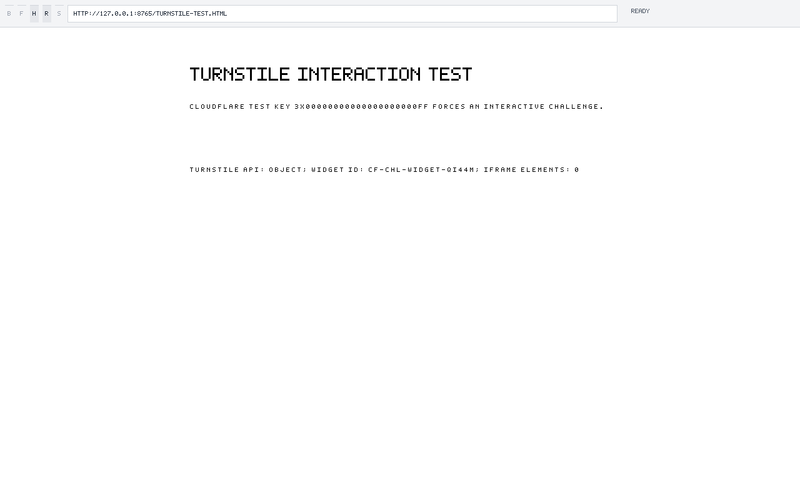

# Cloudflare Turnstile Redirect and Frame Gate

**Date**: 2026-09-23
**Mechanism**: `BasicClient::fetch_parallel` uses HTTP/2 for same-host HTTPS resource batches. The HTTP/2 collector returns redirect responses directly, while `BasicClient::fetch` follows 301, 302, 303, 307, and 308 through a five-hop HTTP/1.1 loop. The Turnstile API script redirects from `/turnstile/v0/api.js` to a versioned API path, so the unhandled HTTP/2 302 leaves the widget in its loading state.
**Question**: can SilkSurf load Cloudflare's interactive Turnstile test widget and expose a real click target through its embedded-content path?

## Verdict

The redirect defect is repaired by continuing an HTTP/2 redirect response through the existing bounded HTTP/1.1 loop. The continuation starts at the response `Location`, so the initial GET is not replayed. The HTTP/2 path now sends and stores subresource cookies and routes origin-restricted batches through the HTTP/1.1 origin check.

The official Cloudflare test key `3x00000000000000000000FF` loads the 86,732-byte Turnstile API and `turnstile.render()` returns a widget identifier. SilkSurf still constructs zero iframe elements, so the interactive widget and its checkbox remain unavailable. The screenshot records the post-redirect state and the measured missing frame.

## Evidence and reproduction

Cloudflare documents the test key as forcing an interactive visible widget in [Test your Turnstile implementation](https://developers.cloudflare.com/turnstile/troubleshooting/testing/). The native X11 probe loads that key through `https://challenges.cloudflare.com/turnstile/v0/api.js`, observes the 302 redirect, loads the redirected script after the network repair, evaluates `turnstile.render()`, and reads `document.querySelectorAll("iframe").length` as zero.

`RUSTFLAGS='-D warnings' CARGO_BUILD_JOBS=2 cargo test -p silksurf-net --all-targets` covers redirect continuation and request-origin enforcement. The live Cloudflare challenge response remains separate evidence: `chatgpt.com` returns HTTP 403 with `cf-mitigated: challenge` for a mainstream Chrome user agent. The Turnstile demo hostname resolves to `209.17.116.165` in system, 1.1.1.1, and 8.8.8.8 lookups, and both SilkSurf and host `curl` receive the same TLS internal alert from that endpoint.

## Residual

The absent iframe is the next falsifier for `iframe-browsing-context`: child document ownership, script and network lifecycle, hit testing, input routing, and damage propagation must produce a visible checkbox before a click test can proceed. The click target is the checkbox inside the rendered child frame; the current screenshot contains no such target.
